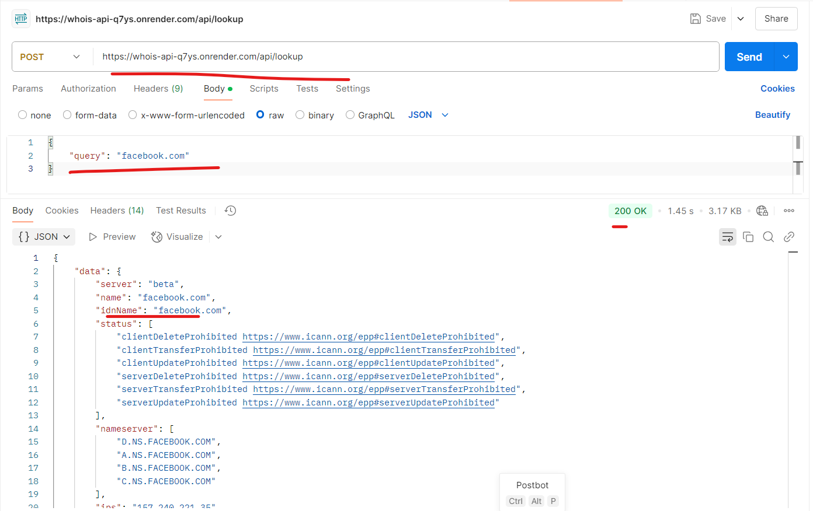

# Whois Lookup API

## Steps to Run the Application Locally

### Clone the Repository
```sh
git clone git@github.com:nagarajalva5790/whois-lookup-api.git
cd whois-lookup-api
```

### Install Dependencies
```sh
npm install
```

### Run the Node Server
```sh
npx ts-node src/server.ts
```

### Test the API with Postman
- **URL:** `http://localhost:5000/api/lookup`
- **Method:** POST
- **Body:**
    ```json
    {
            "query": "example.com"
    }
    ```

## Running the Docker Container

### Pull the Docker Image
```sh
docker pull nagarajalva5790/whois-lookup-api:latest
```

### Run the Docker Container
```sh
docker run -p 5000:5000 nagarajalva5790/whois-lookup-api:latest
```

## Hosted Node Server

The Node server is hosted on Render Webservice. You can access the endpoint directly through Postman with the following URL:

- **URL:** `https://whois-api-q7ys.onrender.com/api/lookup`
- **Method:** POST
- **Body:**
    ```json
    {
            "query": "example.com"
    }
    ```

Screenshots:
